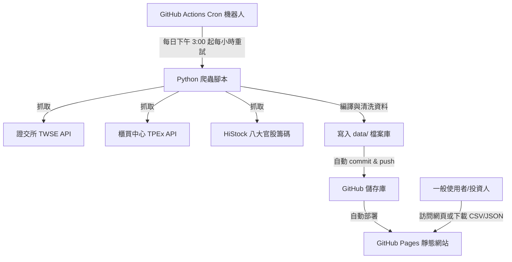

# 📈 台股法人籌碼下載器 (TWStockChips)

這是一個專為台股投資人設計的 **盤後籌碼數據彙整與一鍵導出工具**。網站架構完全基於靜態網頁，無須任何付費資料庫或伺服器，完全依託 GitHub Actions 與 GitHub Pages 提供 100% 穩定、安全的盤後晶片追蹤服務。

### 🌟 線上使用網址
👉 [TWStockChips 線上儀表板](https://9908gg-art.github.io/taiwan-stock--chips/) *(請根據您的 GitHub Pages 網址進行配置)*

---

## 🚀 核心功能與特色

1. **大盤資金概覽**：每日自動統計集中市場 (TSE) 與櫃買市場 (OTC) 的三大法人（外資、投信、自營商）淨買賣超金額。
2. **八大官股動向**：自動整合八大公股行庫（臺銀、土銀、合庫、一銀、華南、彰銀、兆豐、台企銀）的護盤買賣超走勢。
3. **大盤信用交易**：掌握融資餘額、融券餘額增減變化與大盤每日成交總金額。
4. **個股買賣超 Top 10**：快速查看外資、投信當日買賣超張數排行前十名的股票。
5. **一鍵導出 CSV**：一鍵導出經格式化清洗的 Excel 報表，便於導入程式交易或 Google 試算表進行量化分析。
6. **API 數據服務**：提供公開的 `daily_chips.json` API，方便個人程式或開發者介接。

---

## 🛠 系統架構

由於瀏覽器前端存在 CORS 限制無法直接請求證交所 API，本專案採用 **Hybrid 混合架構**：



### 🔁 自動化更新邏輯 (Check-and-Skip)
* 爬蟲排程於台北時間 **周一至周五 15:00 - 20:00** 每小時執行一次。
* **聰明重試與快取**：若當天尚未產出資料，機器人會於下一小時自動重試；一旦成功爬取並寫入，後續小時的執行將於 **1 秒內** 自動偵測並略過，節省儲存庫流量與 Actions 額度。

---

## 📂 資料集說明

* **JSON API 資料**：[data/daily_chips.json](data/daily_chips.json)
* **歷史資料存檔**：[data/daily_chips_history.json](data/daily_chips_history.json)
* **導出 CSV 報表**：[data/daily_chips.csv](data/daily_chips.csv)

---

## 🧑‍💻 本地開發與手動抓取

如果您想在本地端執行爬蟲：

1. **安裝 Python 3** (無須安裝額外依賴套件，皆使用內建 Standard Library 執行)。
2. **執行爬蟲腳本**：
   ```bash
   # 自動爬取當日資料
   python cron_crawler.py
   
   # 手動指定特定日期爬取
   python cron_crawler.py 20260624
   ```

---

## ⚖️ 數據來源聲明

本工具所有原始數據均源自公開之官方與社群統計，僅供學習與研究之用，不構成任何投資建議：
* 臺灣證券交易所 (TWSE)
* 中華民國證券櫃檯買賣中心 (TPEx)
* HiStock 嗨投資理財社群

---

*Made with 💻 by Antigravity AI & the 9908gg-art Team.*
